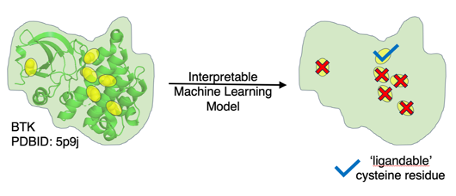

# CovCysPredictor  

CovCysPredictor is a tool that is for predicting the ligandability 
(=reactivity + selectivity) of a particular cysteine residue in a protein. 
It takes as input structural information in the form of a prepared PDB file, 
and outputs a prediction file with one entry for each cysteine giving 
relative ligandability predictions. The predictions are based on an 
interpretable model including the solvent exposure, the inclusion in a 
pocket, and the local amino acid environment.



## Using CovCysPredictor

### Dependencies

This tool has the following dependencies:

* Python (3.10+)
* conda
* [fpocket](https://github.com/Discngine/fpocket) for pocket prediction

The relevant Python packages (Biopython, etc) are conveniently available in a 
conda `environment.yml` file, but otherwise Python package dependencies can be 
managed manually.

The location of your `fpocket` directory may need to be updated in 
`run_cysteine_prediction.sh`.

This tool can be run using the following command:

`./run_cysteine_prediction.sh pdbs/1a55_edited.pdb example_outputs`

And will issue results something like this (ex for PDBID 1a54):

```python
{
    'A 197': {
        'chain': 'A',
        'resid': 197,
        'sasa': 19.301945263655696,
        'log_exp': 3.0107167072525907,
        'any_fpocket': 1,
        'neighbors': ['P', 'A', 'P', 'V', 'E', 'Y', 'Y', 'A', 'K', 'Q', 'L', 'D'],
        'score': '0.32',
        'predicted_modifiable': True
    }
}
```